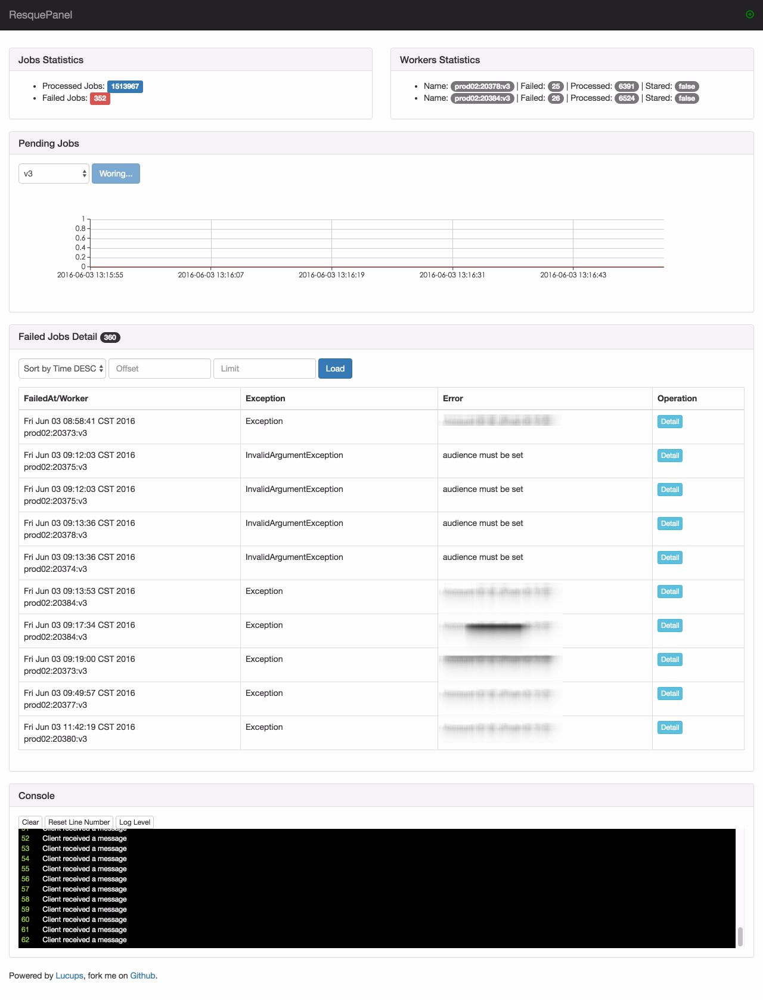
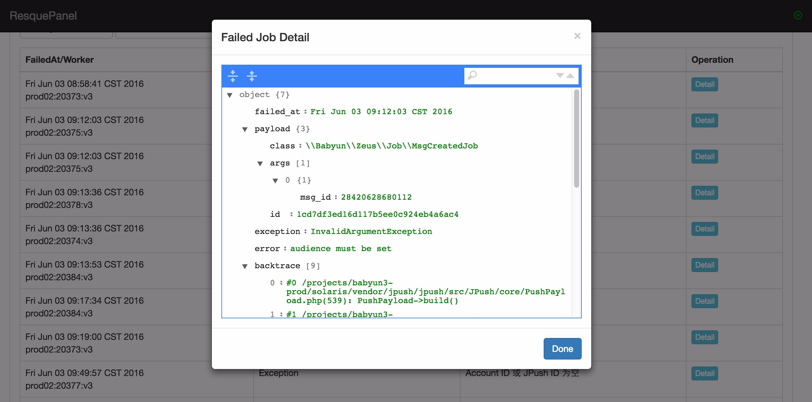

ResquePanel - A simple php-resque web interface monitor.
============================================================

[](https://travis-ci.org/Lucups/resque-panel)

- [中文说明](README_CN.md)

### Install & Configuration

```
# 0. Make sure you have installed swoole and composer

# 1. Clone code from GitHub, and install the libs by composer
git clone https://github.com/Lucups/resque-panel.git
cd resque-panel/
composer install

# 2. Create config file, and edit it
cp ./config/config.dist.php ./config/config.php
vim ./config/config.php

# 3. Start WebSocket server by `nohup` command
nohup php server/resque_panel.php > /tmp/resque_panel.log &

# 4. Start PHP web server (you can also use other web server, just like Nginx or Apache)
php -S localhost:8080 -t web/

# 5. Open your browser, and visit
http://localhost:8080
```

### ScreenShots




### Dependencies

- [Swoole](http://www.swoole.com/)
- [ECharts](http://echarts.baidu.com/)
- [jsoneditor](https://github.com/josdejong/jsoneditor)
- [jQuery](http://jquery.com/)
- [Bootstrap](https://getbootstrap.com/)
- [Juicer](http://juicer.name)

### TODO List

- Unit Test;
- History Data;
- Refactor js WebSocket Client, make it robust;
- More configuration parameters;
- Refactor service layer;
- Authentication Support;